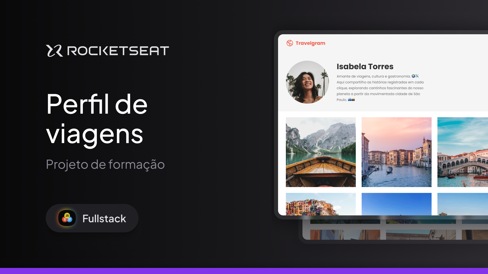

Projeto - Travelgram pela ROCKETSEAT 🚀!  

Olá! Bem-vindo ao Projeto Travelgram. Que bom ter você por aqui. Este projeto é um perfil de viagens.

Sobre o projeto:
Esse perfil foi projetado para oferecer uma apresentação estilosa de um perfil de viagens.
Esse projeto é um estudo desenvolvido durante o curso "Full-stack" da plataforma da Rocketseat 🚀.

Tecnologias utilizadas:
<ul>
<li>HTML5</li>
<li>CSS3</li>
<li>Figma</li>
<li>Git</li>
<li>GitHub</li>
</ul>

Clone o repositório:

git clone https://github.com/StephCruz97/Travelgram.git

Uso
Para usar, simplesmente abra o arquivo index.html no seu navegador e aproveite as funcionalidades.

Licença
Este projeto está licenciado sob a Licença MIT.